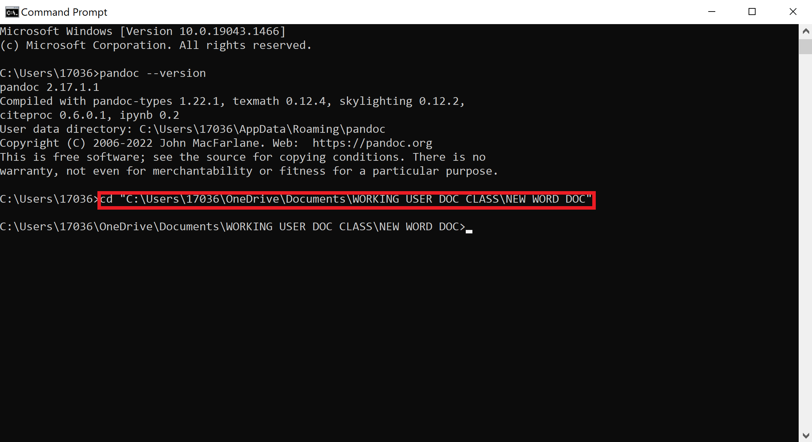

# How to Change the Command Prompt Directory
## This section of the guide will teach you how to change the directory of your command prompt.

# Tools and Requirements
- Computer or laptop with a functioning operating system (such as Windows or MacOS)
    > **NOTE:** Microsoft Windows will be used in this tutorial. 
- Command Prompt app on laptop or computer
- Folder containing the Word document you want to convert into a Markdown file

# Steps
### After verifying that Pandoc has successfully been installed onto your laptop or computer, we must change the directory of your command prompt!

1. **Type** "cd" into the command prompt. 

2. **Press** space. 

3. **Drag** or **type** the folder containing the Word document you want to convert to a Markdown file into the command prompt. 

4. **Press** enter. You have now changed the directory to the folder with your Word document! (Refer to Figure 1)

  
  *Figure 1: The text (cd nameoffolder) that you must type to change the directory of your command prompt is shown here.*

