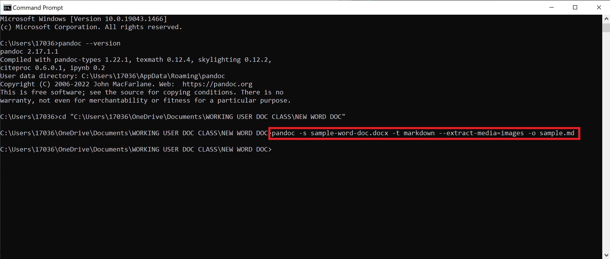
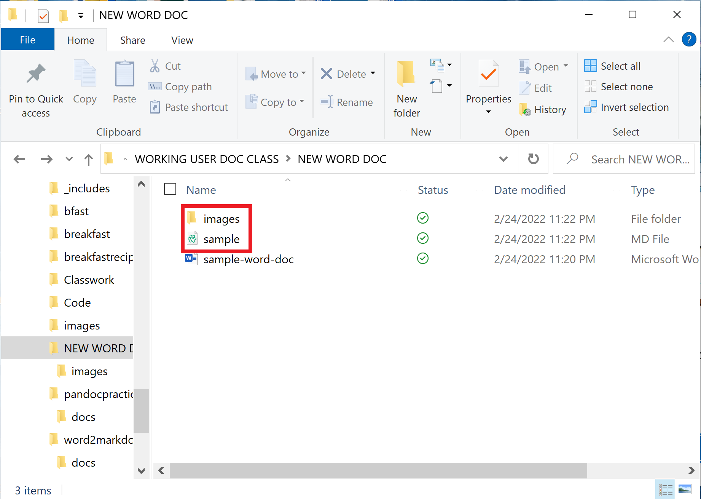

# How to Convert a Word Document into a Markdown File
## This section of the guide will teach you how to convert your Word document into a Markdown file. 

# Tools and Requirements
- Computer or laptop with a functioning operating system (such as Windows or MacOS)
    > **NOTE:** Microsoft Windows will be used in this tutorial. 
- Command Prompt app on laptop or computer
- Folder containing the Word document you want to convert into a Markdown file

# Steps 
### After successfully changing the directory of your command prompt, it's time to actually convert your Word document into a Markdown file!

1. **Type** the following text into the command prompt (Refer to Figure 1).
    
    > pandoc -s nameofworddoc.docx -t markdown --extract-media=images -o nameofworddoc.md
    > HELPFUL TIP: You must type the name of the Word document exactly the way it is named. If the name of your Word document is overly long,rename the .md file into a shorter word, as seen in Figure 1. 

2. **Press** enter.

    
  
  *Figure 1: The text that you must type into the command prompt in Step 1 is shown here. Note that the name of the .md file is short and simple.*

3. **Locate** the folder containing the Word document you just converted to a Markdown file. 

4. **Verify** that you see an .md file of your Word document and an images folder, if your Word document has images (Refer to Figure 2).

    
  
  *Figure 2: The .md file and images folder of the converted Word document is shown here.*

5. Congratulations! You have successfully converted your Word document into a Markdown file!

