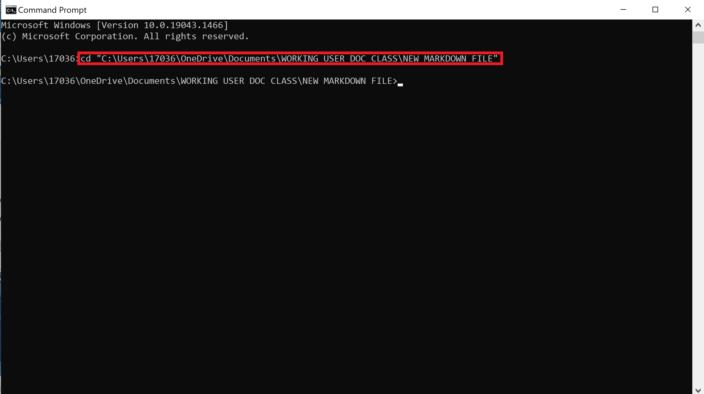
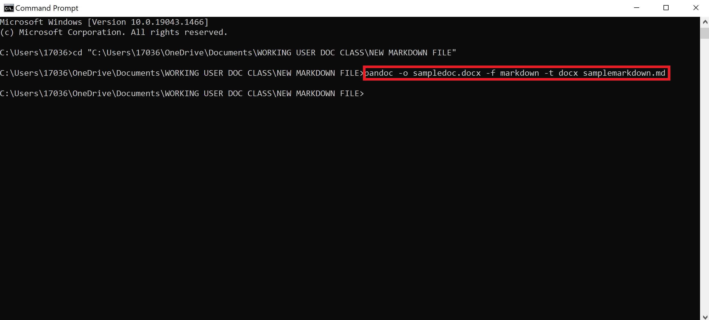
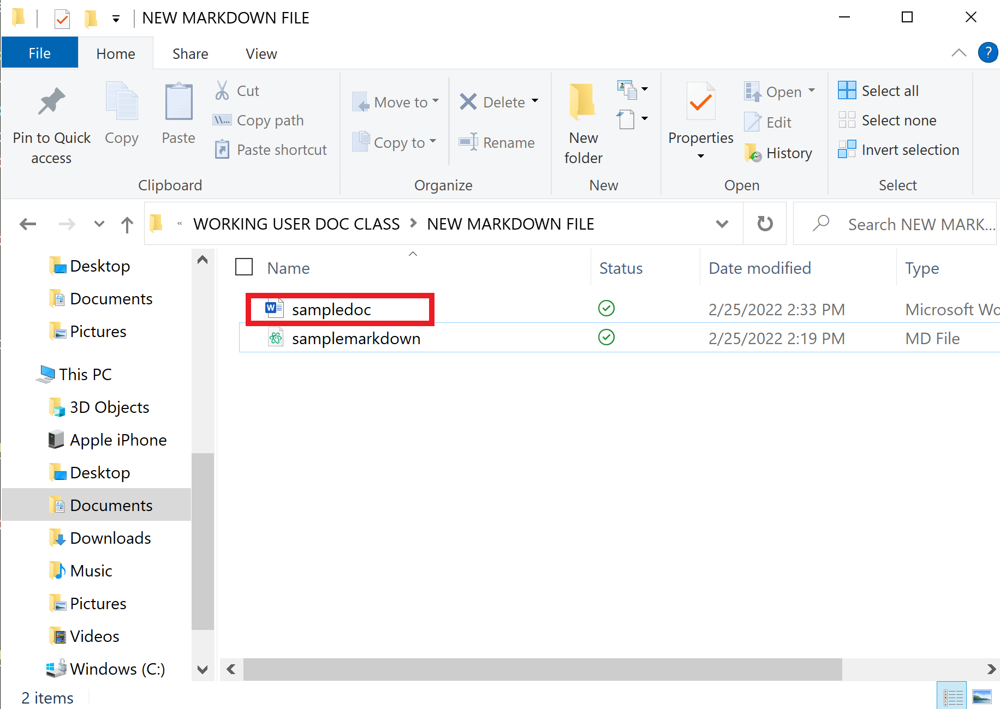

# BONUS: How to Convert a Markdown File into a Word Document
## This bonus section of the guide will teach you how to convert your Markdown file into a Word document. 

Not only can you convert a Word document into a Markdown file using Pandoc, but you can also flip it and convert a Markdown file into a Word document! Luckily, the steps are nearly the same for both conversions with a few small differences. 

# Tools and Requirements 
- Computer or laptop with a functioning operating system (such as Windows or MacOS)
    > **NOTE:** Microsoft Windows will be used in this tutorial. 
- Command Prompt app on laptop or computer
- Folder containing the Markdown file you want to convert into a Word document 

# Steps 
1. **Open** the Command Prompt app on your laptop or computer. 

2. **Type** "cd" into the command prompt and **press** space. 

3. **Drag** or **type** the folder containing the Word document you want to convert to a Markdown file into the command prompt. 

4. **Press** enter. You have now changed the directory of your command prompt to the folder with your Markdwon file! (Refer to Figure 1)

    
  
  *Figure 1: The text (cd nameoffolder) that you must type to change the directory of your command prompt is shown here.*

5. **Type** the following text into the command prompt (Refer to Figure 2).
  
    > pandoc -o choosenameofdoc.docx -f markdown -t docx nameofmarkdownfile.md

6. **Press** enter.

    
  
  *Figure 2: The text that you must type into the command prompt in Step 5 is shown here.*

7. **Locate** the folder containing the Markdown file you just converted to a Word document. 

4. **Verify** that you see an .docx file of your Markdown file (Refer to Figure 3).

    
  
  *Figure 3: The .docx file of the converted Markdown file is shown here.*

5. Congratulations! You have successfully converted your Markdown file into a Word document!

